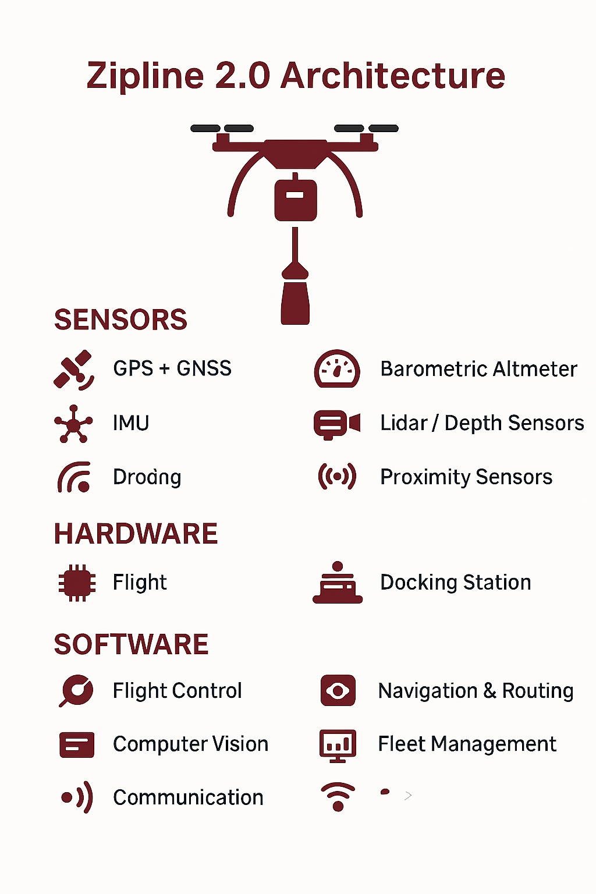
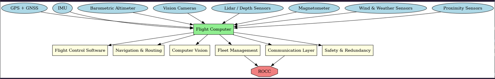
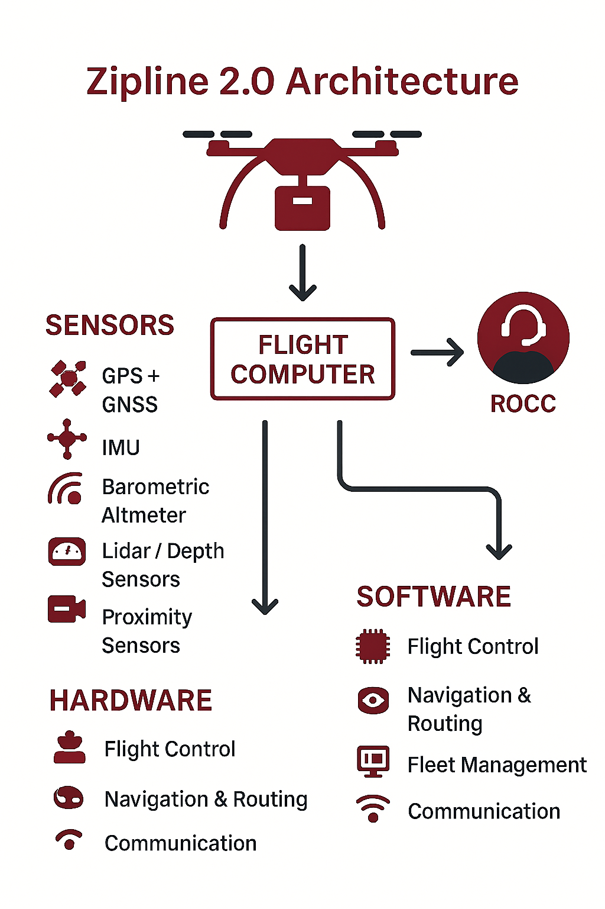
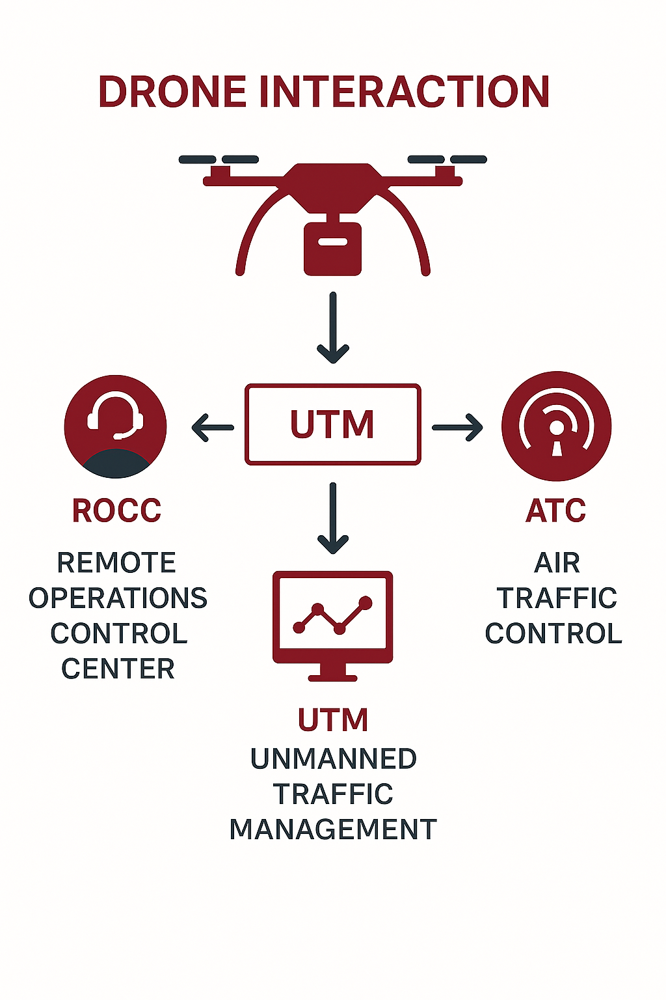

## How many sensors are used in Zipline 2.0? What are sensors name and their use? What other hardware and software used in Zipline 2.0?

Copilot said:   
Here’s a detailed breakdown of Zipline 2.0 sensors, hardware, and software:

### ✅ 1. Sensors Used in Zipline 2.0
Zipline 2.0 (Platform 2) uses a multi-sensor suite for navigation, safety, and precision delivery. While Zipline does not disclose every sensor publicly, based on FAA filings and engineering insights, the typical sensor set includes:

#### Sensor List & Functions

**Sensor :** 	**Purpose**     
:---------------------------------:
* **GPS + GNSS:**	Provides global positioning for navigation and route planning.
* **IMU (Inertial Measurement Unit):**	Measures acceleration and angular velocity for flight stabilization.
* **Barometric Altimeter:**	Maintains altitude accuracy during hover and descent.
* **Vision Cameras:**	Used by the Droid for precision landing and obstacle detection.
* **Lidar / Depth Sensors:**	Assists in tether descent and ground clearance measurement.
* **Magnetometer:**	Helps maintain orientation relative to Earth’s magnetic field.
* **Wind & Weather Sensors:**	Detects wind speed and direction for predictive routing.
* **Proximity Sensors:**	Ensures safe tether deployment and package placement.   

Estimated Count: 8–12 sensors per drone (Zip + Droid combined).

### ✅ 2. Other Hardware Components
Zip Drone (Main Aircraft):
VTOL propulsion system (electric motors + propellers)
Carbon fiber composite airframe
High-capacity lithium battery packs
Redundant flight control computers
Emergency parachute system
Droid (Delivery Bot):
Tether winch system
Precision thrusters for positioning
Vision-based landing system
Docking Station:
Automated charging pads
Environmental protection enclosure
Communication Hardware:
LTE/5G modules for BVLOS connectivity
Redundant RF links for fail-safe control

### ✅ 3. Software Architecture & Technologies
Zipline 2.0 uses a distributed autonomous system with cloud integration:

#### Core Software Components
* Flight Control Software:
  * Real-time OS for drone avionics
  * PX4-based or proprietary autopilot stack
* Navigation & Routing:
  * AI-driven route optimization
  * Predictive weather routing algorithms
* Computer Vision:
  * Object detection for landing zones
  * Obstacle avoidance during tether descent
* Fleet Management:
  * Centralized ROCC dashboard
  * Task assignment and health monitoring
* Communication Layer:
  * Secure telemetry protocols
  * Integration with FAA UTM for airspace compliance
* Safety & Redundancy:
  * 500+ safety checks per second
  * Fail-safe fallback modes

#### Tech Stack:     
* Languages: C++ (flight control), Python (AI & backend)
* Cloud: AWS or similar for fleet orchestration
* AI/ML: TensorFlow or PyTorch for vision and predictive models
* APIs: FAA UTM integration, weather data feeds   

✅ Want me to create a detailed infographic showing Zipline 2.0 architecture (Sensors + Hardware + Software)?
Or prepare a technical table mapping each sensor to its role in autonomous delivery?

## create a detailed infographic showing Zipline 2.0 architecture (Sensors + Hardware + Software) and prepare a technical table mapping each sensor to its role in autonomous delivery
Copilot said:

### ✅ Infographic: Zipline 2.0 Architecture

* Sensors: GPS + GNSS, IMU, Barometric Altimeter, Lidar/Depth Sensors, Proximity Sensors.
* Hardware: Flight systems, Docking station, Droid tether system.
* Software: Flight Control, Navigation & Routing, Computer Vision, Fleet Management, Communication layer.

✅ Do you want me to extend this into a full technical architecture diagram (showing data flow between sensors, flight computer, and ROCC)? Or prepare a hardware-software integration blueprint for your drone project?

## Extend this into a full technical architecture diagram (showing data flow between sensors, flight computer, and ROCC) and prepare a hardware-software integration blueprint for your drone project
Copilot said:
Copilot

Analysis
Here’s what I prepared for you:

### ✅ Full Technical Architecture Diagram

#### Explanation of Data Flow:

* **Sensors → Flight Computer:** All sensor data (GPS, IMU, Lidar, Cameras Weather) feeds into the flight computer for real-time decision-making.
* **Flight Computer → Software Modules:**
  * **Flight Control:** Stabilization and motor commands.
  * **Navigation & Routing:** Path planning and predictive weather routing.
  * **Computer Vision:** Precision landing and obstacle avoidance.
  * **Fleet Management & Communication:** Sync with ROCC for task assignment and monitoring.
* **ROCC ↔ Communication Layer:** Human-in-the-loop for overrides, airspace coordination, and emergency protocols.

### ✅ Hardware-Software Integration Blueprint

Blueprint Highlights:

* Hardware Stack:
  * Flight Computer (redundant processors)
  * VTOL propulsion system
  * Docking station with automated charging
* Software Stack:
  * Real-time OS for avionics
  * AI-driven navigation and weather prediction
  * Vision-based landing algorithms
  * Secure communication protocols integrated with FAA UTM
* Integration Points:
  * Sensor fusion for navigation and safety
  * Cloud-based fleet orchestration
  * ROCC override capability for BVLOS compliance

✅ Do you want me to extend this blueprint into a full implementation guide (including API examples, sensor fusion algorithms, and FAA compliance steps)? Or create a combined infographic showing ROCC + UTM + ATC + Drone interaction for your project?

You said:

## Include all used algorithms such as sensor fusion and other algorithms, include FAA compliance steps. create a combined infographic showing ROCC + UTM + ATC + Drone interaction for your project
Copilot said:

Here’s what I created for you:

### ✅ Combined Infographic: ROCC + UTM + ATC + Drone Interaction
The image above shows:

* Drone → UTM: Sends telemetry and flight plans.
* UTM ↔ ROCC: Provides airspace updates and conflict alerts.
* UTM ↔ ATC: Coordinates with manned aircraft and controlled airspace.
* ROCC: Human-in-the-loop for overrides and emergency protocols.

### ✅ Detailed Hardware-Software Integration Blueprint

What’s Inside:

* Algorithms Used:
  * Sensor Fusion: Combines GPS, IMU, barometer, magnetometer, vision data for accurate state estimation.
  * Navigation & Routing: AI-based path planning with predictive weather routing.
  * Computer Vision: Obstacle detection and precision landing using deep learning (YOLO/SSD).
  * Predictive Weather Routing: ML models for dynamic rerouting based on real-time weather.
* FAA Compliance Steps:
  * Part 135 Air Carrier Certification.
  * UTM integration for flight plan submission.
  * RPIC oversight via ROCC.
  * Logging for FAA audits.
  * NEPA environmental safety assessments.
  * Emergency parachute and fail-safe systems.

### ✅ Next Steps:
  Do you want me to extend this into a full implementation guide with API examples for UTM integration, sensor fusion code snippets, and FAA compliance checklist? Or create a layered architecture diagram showing data flow from sensors → flight computer → cloud → ROCC → UTM → ATC?

