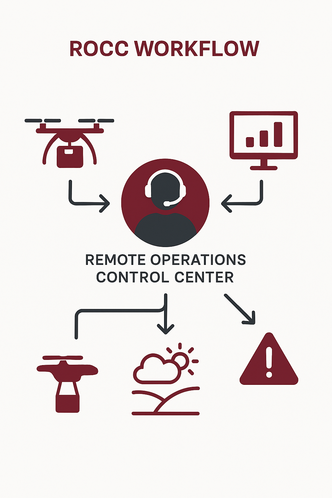
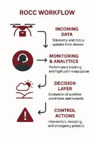

I have couple of questions regarding Zipline 2.0. Help to resolve it and give me detailed explanation of each question.
1.Technologies used behind Zipline 2.0. 
2. Zipline 2.0 features.
3. Which certifications they own for delivery drone? 
4. What standard they follow? 
5. How much it cost them to create Zipline 2.0?
6. How it works?
7. How they control the delivery operations?
8. What kind of precautions they follow for the safety?
9. Are they follow any standard such as ASAM OpenODD for their project defination?
10. How drone get the new delivery task notification or how they get assigned for the new task?
11. Is there any safety incident happen with Zipline 2.0 till now?
Copilot said:
Copilot
Here are detailed answers to your questions about Zipline 2.0, based on the latest available information:

## 1. Technologies Used Behind Zipline 2.0
Zipline 2.0 (also known as Platform 2 or P2) uses a multi-robot system:

Zip: The main drone that flies long distances and hovers at 300 feet.
Droid: A tethered autonomous delivery bot that descends from the Zip to deliver packages precisely.
Technologies include:
VTOL (Vertical Takeoff and Landing) aircraft
Autonomous navigation and obstacle avoidance
Visual sensors and thrusters on the Droid
Parachute-based emergency systems
Weather-resistant design for rain, wind, and heat.
https://m365.cloud.microsoft/chat/?fromcode=edgentp&redirectid=68c08938feca457baf63d5ec56a1274f&auth=2&handinClickTs=1757449968169&internalredirect=CCM#:~:text=https%3A//www.thedronegirl.com/2024/09/23/platform%2D2%2Dzipline/
## 2. Zipline 2.0 Features
Precision Delivery: Droid can deliver within a 1-meter radius.
Quiet Operation: Zips hover at altitude, minimizing noise.
Weather Resilience: Operates in adverse conditions.
Safety Systems: Includes parachutes and cable-cut mechanisms.
Modular Docking: Drones dock and recharge autonomously.
Service Radius: ~10 miles with ~10-minute delivery times.
https://m365.cloud.microsoft/chat/?fromcode=edgentp&redirectid=68c08938feca457baf63d5ec56a1274f&auth=2&handinClickTs=1757449968169&internalredirect=CCM#:~:text=https%3A//www.thedronegirl.com/2024/09/23/platform%2D2%2Dzipline/
## 3. Certifications for Delivery Drone
Zipline operates under FAA Part 135 Air Carrier Certification, which allows it to conduct commercial BVLOS (Beyond Visual Line of Sight) operations. They also hold waivers for:

14 CFR 91.113(b) (right-of-way rules)
Certificate of Waiver or Authorization (COA) for specific airspace operations.
https://www.faa.gov/sites/faa.gov/files/2022-06/EA_Zipline_Pea%20Ridge-and-Surrounding-Area.pdf
## 4. Standards Followed
Zipline adheres to:

FAA regulations for commercial drone operations
NEPA environmental review standards
Operational safety protocols similar to airline OCCs and ATC centers.
https://www.zipline.com/newsroom/stories/articles/future-remote-operations-drones
## 5. Development Cost
While the exact cost of Zipline 2.0 is not publicly disclosed, Zipline raised $250 million in 2021 to expand its logistics network, and has raised over $1.2 billion in total funding.
https://techcrunch.com/2021/06/30/zipline-raises-250m-at-2-75b-valuation-to-build-out-its-instant-logistics-service/

## 6. How It Works
User places an order via app.
Package is loaded into a pod.
Zip drone flies to the location and hovers.
Droid descends via tether and places the package.
Droid returns to Zip, which flies back to base.
https://gigazine.net/gsc_news/en/20250331-zipline-drone-delivery/
## 7. Delivery Operations Control
Zipline uses a Remote Operations Control Center (ROCC) in North Carolina:

Monitors all drones nationwide.
Staffed by Remote Pilots in Command (RPICs).
Can override flight paths for safety.
Centralized control enables scalable operations.
https://www.zipline.com/newsroom/stories/articles/future-remote-operations-drones
## 8. Safety Precautions
Multi-layer safety systems:
Parachutes on both Zip and Droid.
Emergency cable-cutting.
Obstacle avoidance sensors.
Weather protection: Insulated pods and robust flight control.
FAA oversight: Environmental and operational safety assessments.
faa
## 9. Use of ASAM OpenODD or Similar Standards
There is no public confirmation that Zipline uses ASAM OpenODD, but their operational design domain (ODD) is clearly defined in FAA documentation. They follow structured environmental and operational modeling, which aligns with OpenODD principles.
https://www.faa.gov/sites/faa.gov/files/2022-06/EA_Zipline_Pea%20Ridge-and-Surrounding-Area.pdf

## 10. Task Assignment System
Zipline drones are assigned tasks via centralized software.
ROCC oversees task distribution and drone health.
Drones launch from docking stations and receive delivery instructions remotely.
Autonomous systems handle navigation and delivery execution.
https://www.zipline.com/newsroom/stories/articles/future-remote-operations-drones
## 11. Safety Incidents
As of now, Zipline has flown over 100 million autonomous miles with no major safety incidents reported. Their safety record is considered one of the best in the industry.
https://www.zipline.com/about/zipline-fact-sheet 

Would you like a visual flowchart of how Zipline 2.0 operates or a technical breakdown of the drone architecture?

You said:

## Explain the role of the ROCC in detail and How does Zipline ensure drone reliability?

Copilot

Here’s a detailed breakdown of the Remote Operations Control Center (ROCC) and how Zipline ensures drone reliability:

## 🧠 Role of the ROCC (Remote Operations Control Center)
Zipline’s ROCC is a centralized command and monitoring facility located in Concord, North Carolina, designed to oversee and manage fleets of autonomous drones across the U.S. It plays a critical role in scaling drone delivery operations safely and efficiently.

Key Functions of the ROCC:

### 1. Fleet Monitoring
#### - Operators (Remote Pilots in Command or RPICs) monitor all active drones in real-time.
#### - They track flight paths, system health, and weather conditions across multiple distribution centers.
https://www.zipline.com/newsroom/stories/articles/future-remote-operations-drones

### 2. Safety Oversight
#### - ROCC staff validate procedures and intervene if anomalies occur.
#### - They can initiate emergency protocols, such as parachute deployment or flight aborts.

### 3. Operational Coordination
#### - Functions similarly to airline OCCs and ATC centers.
#### - Coordinates responses to maintenance issues, regulatory compliance, and operational disruptions.

### 4. Scalability
#### - Enables Zipline to manage thousands of flights from a single location.
#### - Supports platform-agnostic operations for Zipline’s next-gen P2 drones.
https://www.linkedin.com/posts/josephemarshall_we-are-excited-to-share-that-zipline-has-activity-7168295953471377408-cewr/

### 5. Regulatory Interface
#### - Acts as a central point of contact for FAA and other stakeholders.
#### - Ensures compliance with aviation standards and waivers.

## 🔧 How Zipline Ensures Drone Reliability
Zipline has developed one of the most rigorous reliability and safety testing programs in the drone industry.

### Reliability Measures:

### 1. Massive Testing Campaigns
#### - Over 150,000 real-world test deliveries and tens of millions of virtual flights before launch.
#### - More test flights than the F-35 fighter jet before its service entry.
https://www.zipline.com/newsroom/news/announcements/inside-how-zipline-tests-and-improves-safety-systems

### 2. Component Stress Testing
#### - Some components have been cycle-tested over 4 million times.
#### - Weekly testing includes 9,000+ flights to validate updates and performance.

### 3. Redundant Safety Systems
#### - Drones perform 500+ safety checks per second.
#### - Emergency systems include parachutes, motor-out compensation, and tether cut-off mechanisms.

### 4. Incident Response Protocols
#### - Example: In a test, Zip 290 had a motor deliberately disabled mid-flight.
#### - The drone attempted recovery, and when unable to dock, deployed its parachute and landed safely on a designated barrier.
https://www.zipline.com/newsroom/news/announcements/inside-how-zipline-tests-and-improves-safety-systems

### 5. Dedicated Maintenance Facilities
#### - Zipline is opening a drone maintenance center in Richardson, Texas, to support ongoing reliability and servicing.
https://communityimpact.com/dallas-fort-worth/richardson/business/2025/03/20/zipline-expected-to-open-drone-maintenance-center-in-richardson/

### 6. Continuous Improvement
#### - Flight data is analyzed to refine software and hardware.
#### - Updates are rolled out only after passing extensive simulations and real-world tests.

Would you like a visual diagram of the ROCC workflow or a checklist of Zipline’s safety protocols for your drone project?

You said:

**Show a diagram of the ROCC workflow and List Zipline's drone safety protocols**
Copilot said:

Here’s the requested information:

### ✅ ROCC Workflow Diagram
The image above illustrates the Remote Operations Control Center (ROCC) workflow:

Incoming Data: Drones send telemetry and status updates to ROCC.
Monitoring & Analytics: ROCC operators track performance and flight paths via dashboards.
Decision Layer: ROCC evaluates weather conditions and potential hazards.
Control Actions: Operators can intervene, reroute, or trigger emergency protocols.
### ✅ Zipline Drone Safety Protocols
Zipline follows a layered safety approach integrated into design, flight, and operations:

#### 1. Human-Friendly Design

Drones hover hundreds of feet above people and pets during delivery.
#### 2. Built-in Redundancies

Multiple backups for flight-critical systems (computing, sensors, comms).
#### 3. Reliable Materials

Lightweight carbon fiber and foam for durability and crash safety.
#### 4. Obstacle Avoidance

AI-driven navigation to steer clear of obstacles using real-world data.
#### 5. Predictive Weather Routing

Real-time weather data for safe flight planning.
#### 6. Onboard Autonomy

Detects and avoids other aircraft; performs 500+ safety checks per second.
#### 7. Emergency Systems

Parachutes and tether cut-off mechanisms for controlled landings.
#### 8. Rigorous Testing

Tens of millions of virtual flights and 150,000+ real-world test deliveries.
Components cycle-tested over 4 million times.
#### 9. Remote Monitoring

24/7 fleet oversight by ROCC with human-in-the-loop intervention capability.
#### 10. Formal Safety Management System (SMS)

FAA-compliant hazard identification, risk mitigation, and safety culture.
https://www.zipline.com/safety

https://www.zipline.com/newsroom/stories/articles/engineering-for-safe-drone-delivery

https://brodyzacharyaviationsafetyblog.blogspot.com/2025/05/ziplines-safety-strategy-autonomous.html

Would you like me to create a detailed infographic combining ROCC workflow and safety layers for presentation purposes? Or should I prepare a technical checklist for implementing similar safety protocols in your drone project?

You said:

## Create an infographic of ROCC workflow. Explain predictive weather routing
Copilot said:
Copilot

**Here’s the ROCC Workflow infographic you requested. It shows the four main stages:**

**Incoming Data** – Telemetry and status updates from drones.
**Monitoring & Analytics** – Performance tracking and flight path visualization.
**Decision Layer** – Evaluation of weather conditions and hazards.
**Control Actions** – Intervention, rerouting, and emergency protocols.
### 🌤 Predictive Weather Routing Explained
Zipline uses predictive weather routing to ensure safe and efficient deliveries:

**Real-Time Weather Data**: The system continuously ingests data from local sensors, radar, and forecasts.

**Dynamic Flight Planning**: Routes are adjusted before and during flight to avoid storms, high winds, or temperature extremes.

**Machine Learning Models**: Predictive algorithms analyze historical and live data to anticipate weather changes.

**Safety Thresholds**: If conditions exceed predefined limits (e.g., wind speed, precipitation), the drone will reroute or abort the mission.

**Integration with ROCC**: ROCC operators receive alerts and can override or confirm automated rerouting decisions.

This approach minimizes delays and prevents drones from entering unsafe conditions.

Would you like me to create a combined infographic showing ROCC workflow + predictive weather routing logic? Or prepare a technical flowchart for implementing predictive routing in your drone system?

**How does ROCC override automated routing?**

Copilot said:   
The ROCC override process works as a human-in-the-loop safety mechanism layered on top of Zipline’s autonomous routing system. Here’s how it functions:

### 1. Continuous Monitoring
ROCC operators receive real-time telemetry from every drone, including:     
* Position, altitude, speed   
* Battery health  
* Weather conditions along the route  
* System alerts (e.g., obstacle detection, wind gusts)

### 2. Automated Routing Logic
* The drone’s onboard system uses predictive algorithms to reroute around hazards (storms, restricted airspace).  
* If conditions exceed safety thresholds, the drone will:
  * Pause   
  * Request a new route from the central system     
  * Or initiate a return-to-base sequence

### 3. Override Trigger
ROCC can override automated routing when:   
* Weather data shows rapid deterioration beyond the drone’s predictive model.
* Airspace conflicts arise (e.g., emergency helicopter activity).
* Drone health anomalies occur (e.g., motor failure, sensor malfunction).

### 4. Manual Intervention
Operators use a secure control interface to:
* Issue new waypoints or reroute commands.
* Command an immediate Return-to-Base (RTB).
* Trigger emergency landing protocols (e.g., parachute deployment).
### 5. Fail-Safe Integration
Overrides are logged and audited for compliance.
The system ensures priority of human commands over autonomous logic.
If communication fails, drones default to pre-programmed safe behaviors (hover, land in designated zones).
Would you like me to design a flowchart showing the interaction between autonomous routing and ROCC override? Or prepare a technical architecture diagram for implementing similar override logic in your drone system?

## How does ROCC handle airspace conflicts?
Copilot said:

The ROCC (Remote Operations Control Center) handles airspace conflicts through a combination of automated systems and human oversight. Here’s how it works:

### 1. Real-Time Airspace Awareness
* ROCC integrates data from:
  * FAA UTM (Unmanned Traffic Management) systems.
  * Local ATC advisories.
  * Zipline’s internal geofencing and airspace maps.    
* Drones continuously broadcast their position and receive updates on restricted zones or temporary flight restrictions (TFRs).

### 2. Automated Conflict Detection
* The system runs predictive algorithms to detect potential conflicts with:
  * Other drones.
  * Manned aircraft (e.g., helicopters, small planes).
  * Temporary no-fly zones (e.g., emergency response areas).
* If a conflict is detected, the drone autonomously:
  * Adjusts altitude or reroutes.
  * Slows down or pauses in a safe holding pattern.

### 3. Human-in-the-Loop Override
ROCC operators receive alerts for high-priority conflicts.
They can:
* Issue manual reroute commands.
* Trigger Return-to-Base (RTB).
* Coordinate with ATC for clearance if needed.

### 4. Fail-Safe Protocols
If communication with ROCC fails:
The drone defaults to pre-programmed safe zones or emergency landing sites.
Redundant systems ensure compliance with FAA Part 135 and BVLOS safety requirements.
Would you like me to create a flowchart showing the airspace conflict resolution process (automated + ROCC intervention)? Or prepare a technical architecture diagram for integrating UTM and ATC data into your drone system?

## How does ROCC coordinate with ATC?
Copilot said:
Copilot
Zipline’s ROCC (Remote Operations Control Center) coordinates with Air Traffic Control (ATC) using a structured, FAA-compliant approach designed for BVLOS (Beyond Visual Line of Sight) operations. Here’s how it works:

### 1. Integration with FAA Systems
* ROCC connects to FAA UTM (Unmanned Traffic Management) platforms and receives:
  * Temporary Flight Restrictions (TFRs)
  * Notices to Airmen (NOTAMs)
  * Airspace status updates
* This ensures drones operate within approved corridors and avoid restricted zones.

### 2. Pre-Flight Clearance
* Before launching, ROCC verifies:
  * Airspace availability
  * Any active TFRs or emergency operations
* If required, ROCC coordinates with local ATC for clearance in controlled airspace.

### 3. Real-Time Conflict Resolution
* If a manned aircraft enters the drone’s operational area:
  * Automated systems detect the conflict and alert ROCC.
  * ROCC can reroute the drone, command it to hold position, or initiate RTB (Return-to-Base).
* ROCC communicates with ATC via:
  * Dedicated phone lines
  * Digital coordination tools (FAA-approved interfaces)

### 4. Emergency Coordination
* In case of emergencies (e.g., medical helicopter operations), ROCC:
  * Immediately suspends drone flights in the affected zone.
  * Confirms clearance with ATC before resuming operations.

### 5. Compliance and Logging
* All ATC interactions and overrides are logged for FAA audits.
* Zipline operates under FAA Part 135 Air Carrier Certificate, which mandates strict coordination protocols.

Would you like me to create a detailed diagram showing ROCC–ATC communication flow or prepare a technical checklist for integrating ATC coordination into your drone system?

## Explain FAA UTM integration
Copilot said:

FAA UTM (Unmanned Traffic Management) integration is the backbone of safe BVLOS drone operations like Zipline’s. Here’s how it works:

### 1. What is FAA UTM?
* UTM is a digital traffic management system for drones, developed by the FAA and NASA.
* It enables drones to share their position, flight plans, and status with other airspace users and ATC without requiring traditional radar or voice communication.

### 2. How Zipline Integrates with UTM
* **Flight Plan Submission**: Before launch, Zipline’s ROCC sends the drone’s route and operational parameters to the UTM system.
* **Real-Time Position Updates**: Drones continuously broadcast telemetry (location, altitude, speed) to UTM.
* **Dynamic Airspace Data**: UTM provides:
  * Temporary Flight Restrictions (TFRs)
  * Notices to Airmen (NOTAMs)
  * Weather and hazard alerts
* **Conflict Detection**: UTM algorithms check for potential conflicts with other drones or manned aircraft and notify ROCC.

### 3. Benefits of Integration
* **BVLOS Compliance**: Meets FAA requirements for beyond visual line of sight operations.
* **Airspace Deconfliction**: Prevents collisions by sharing data across all UTM participants.
* **Scalability**: Allows thousands of drones to operate simultaneously without overwhelming ATC.

### 4. ROCC’s Role
* ROCC acts as the human-in-the-loop:
  * Monitors UTM alerts.
  * Overrides drone routing if UTM flags a conflict.
  * Coordinates with ATC when entering controlled airspace.

Would you like me to create a technical diagram showing Zipline’s UTM integration architecture (ROCC ↔ UTM ↔ ATC ↔ Drone)? Or prepare a step-by-step workflow for implementing UTM in your autonomous drone system?

## create a technical diagram showing Zipline’s UTM integration architecture (ROCC ↔ UTM ↔ ATC ↔ Drone) and prepare a step-by-step workflow for implementing UTM in your autonomous drone system
Copilot said:

Flow Explanation:

**ROCC ↔ UTM**: ROCC sends flight plans and receives airspace updates.  
**UTM ↔ ATC**: UTM exchanges data with ATC for controlled airspace coordination.    
**UTM ↔ Drone**: Drones broadcast telemetry and receive rerouting instructions.     

### Step-by-Step Workflow for Implementing FAA UTM Integration

Summary of Steps:
1. Register your drone system with an FAA UTM service provider.
2. Implement telemetry broadcasting (position, altitude, speed) to UTM.
3. Develop a flight plan submission interface for pre-launch route approval.
4. Integrate UTM APIs to receive TFRs, NOTAMs, and weather alerts.
5. Implement conflict detection logic using UTM data.
6. Build override capability in your control center (ROCC) for rerouting or aborting.
7. Log all UTM interactions for FAA compliance.
8. Test integration with simulated and real-world flights under FAA supervision.
9. Maintain communication with ATC via UTM or direct channels.
10. Update integration regularly to comply with evolving FAA standards.

✅ Do you want me to extend this workflow into a full technical implementation guide (including API examples, architecture diagrams, and compliance checklists)? Or create a combined infographic showing ROCC + UTM + ATC interaction with drones?